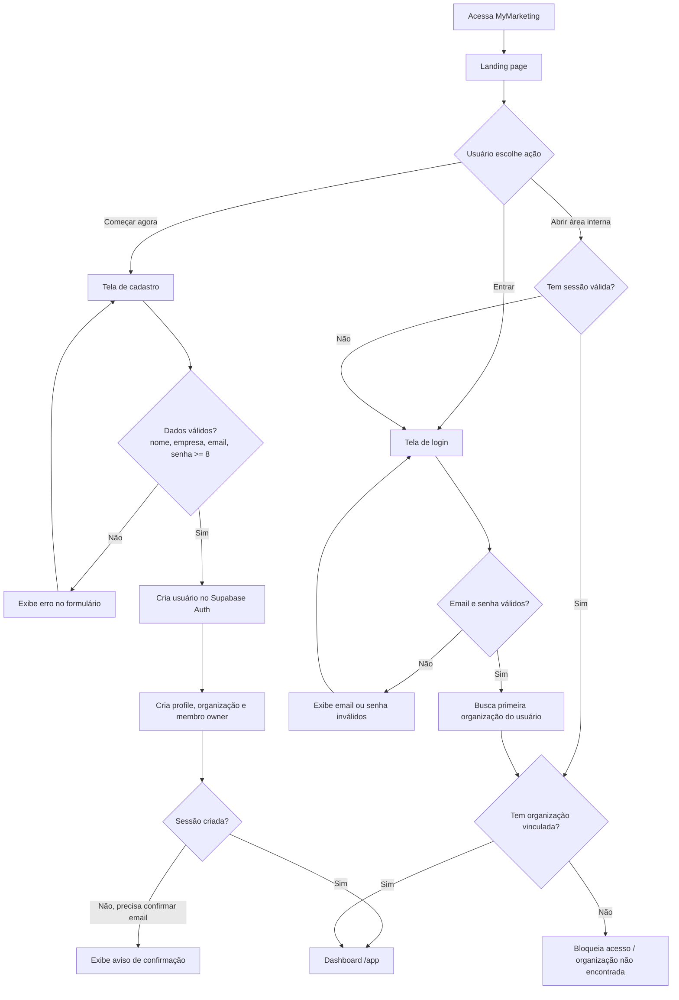
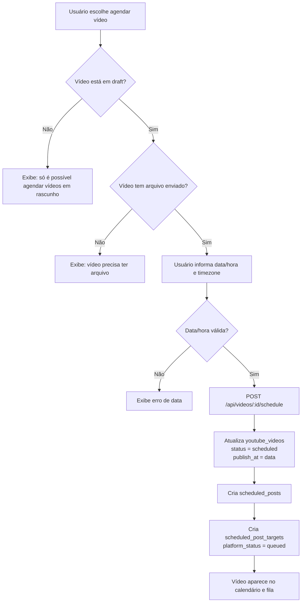
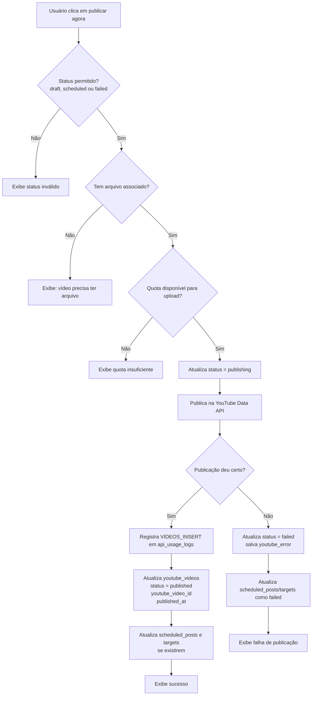
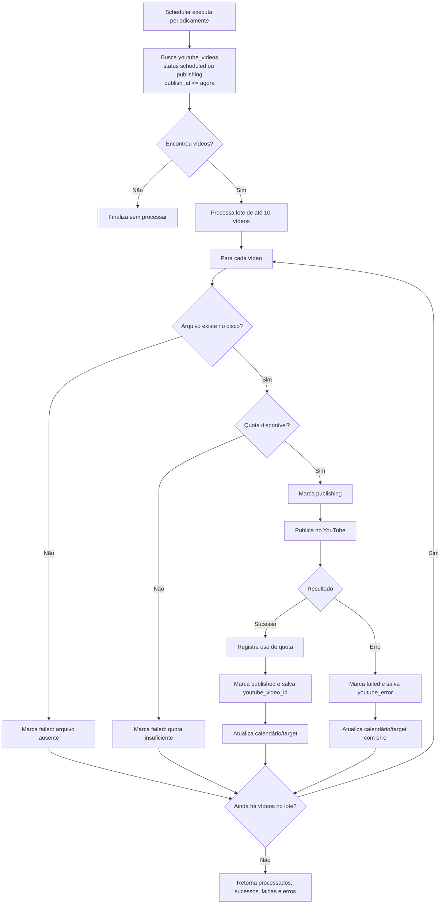
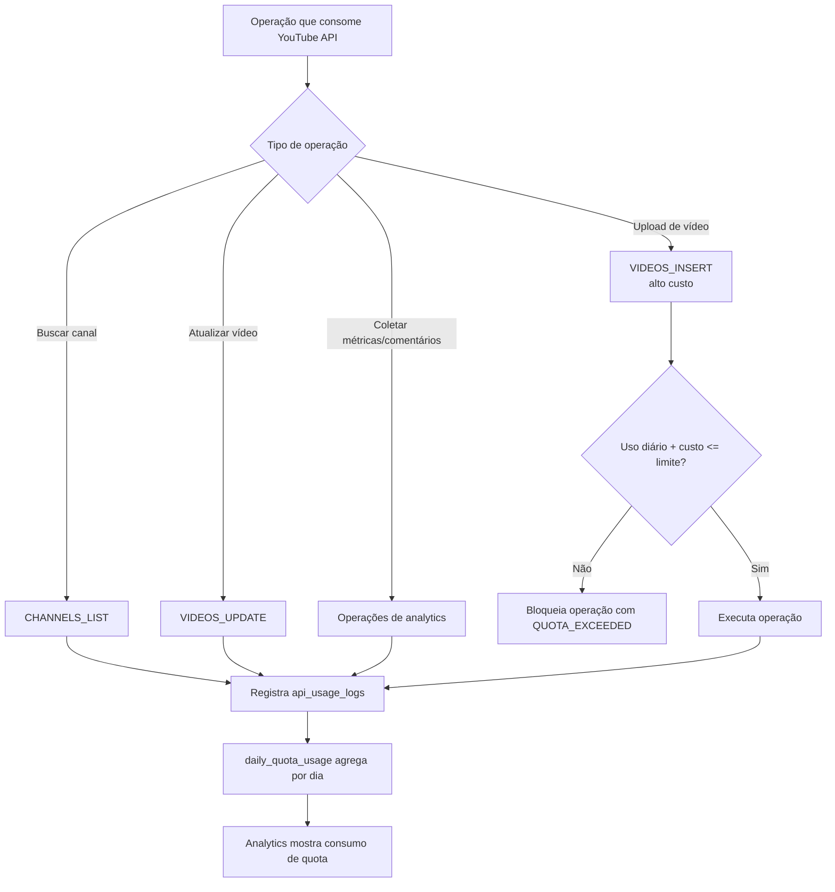
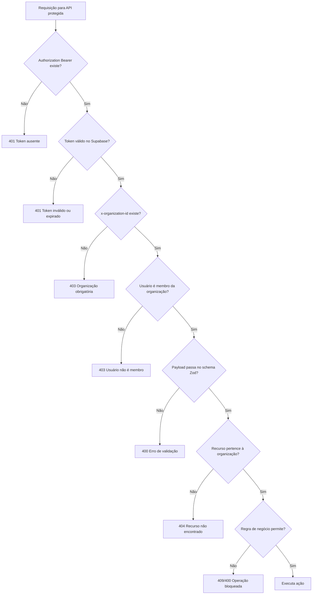

# Fluxo de Uso do Sistema MyMarketing

Este documento é um **fluxo de usuário** / **diagrama de atividade** do MyMarketing. Ele descreve os caminhos possíveis dentro do sistema, incluindo telas, validações, decisões e resultados esperados.

## Entrada no Sistema



## Regra Global de Acesso às Telas Internas

```mermaid
flowchart TD
  internal[Acessa qualquer rota interna<br/>/app, /app/videos, /app/canais, /app/calendario, /app/analytics]
  internal --> token{Existe accessToken?}
  token -->|Não| login[/login]
  token -->|Sim| authMe[Valida sessão em /api/auth/me]
  authMe --> validSession{Token válido?}
  validSession -->|Não ou expirado| login
  validSession -->|Sim| orgHeader{Existe organização selecionada?}
  orgHeader -->|Não| login
  orgHeader -->|Sim| membership{Usuário pertence à organização?}
  membership -->|Não| forbidden[Acesso negado]
  membership -->|Sim| page[Renderiza tela solicitada]
```

## Dashboard Principal

```mermaid
flowchart TD
  dashboard[Dashboard /app] --> loadData[Carrega resumo da organização]
  loadData --> checkChannels{Existe canal YouTube conectado?}
  loadData --> checkVideos{Existem vídeos criados/agendados?}
  loadData --> checkAnalytics{Existem métricas coletadas?}

  checkChannels -->|Não| suggestChannel[Mostra ação: conectar canal]
  checkChannels -->|Sim| showChannels[Mostra canais e status]

  checkVideos -->|Não| suggestUpload[Mostra ação: subir vídeo]
  checkVideos -->|Sim| showQueue[Mostra próximos posts / fila]

  checkAnalytics -->|Não| emptyAnalytics[Mostra estado vazio de analytics]
  checkAnalytics -->|Sim| showCards[Mostra indicadores e atalhos]

  suggestChannel --> channels[/app/canais]
  suggestUpload --> videos[/app/videos]
  showCards --> analytics[/app/analytics]
```

## Conexão de Canal do YouTube

```mermaid
flowchart TD
  channels[Acessa /app/canais] --> authCheck{Autenticado e com organização?}
  authCheck -->|Não| login[/login]
  authCheck -->|Sim| listChannels[Lista canais conectados]

  listChannels --> connectAction{Usuário quer conectar canal?}
  connectAction -->|Não| manage[Visualiza, testa ou desconecta canais]
  connectAction -->|Sim| requestOAuth[GET /api/channels/youtube/connect]

  requestOAuth --> authUrl{API retornou authUrl?}
  authUrl -->|Não| connectError[Exibe erro]
  authUrl -->|Sim| google[Redireciona para Google OAuth]

  google --> consent{Usuário autorizou?}
  consent -->|Não| callbackError[Volta para /app/canais com erro]
  consent -->|Sim| callback[/api/channels/youtube/callback]

  callback --> stateValid{State contém org e usuário válidos?}
  stateValid -->|Não| callbackError
  stateValid -->|Sim| memberValid{Usuário pertence à organização?}
  memberValid -->|Não| callbackError
  memberValid -->|Sim| exchange[Troca code por tokens]

  exchange --> channelInfo[Busca dados do canal]
  channelInfo --> saveChannel[Salva em social_accounts]
  saveChannel --> connected[Volta para /app/canais com sucesso]

  manage --> test{Testar conexão?}
  test -->|Sim| refreshToken[Renova token e busca info do canal]
  refreshToken --> tokenOk{Token válido?}
  tokenOk -->|Sim| syncVideos[Sincroniza vídeos do canal]
  tokenOk -->|Não| markExpired[Marca canal como expired]

  manage --> disconnect{Desconectar?}
  disconnect -->|Sim| deleteChannel[Remove social_account]
```

## Upload e Criação de Vídeo

```mermaid
flowchart TD
  videos[Acessa /app/videos] --> authCheck{Autenticado e com organização?}
  authCheck -->|Não| login[/login]
  authCheck -->|Sim| listVideos[Lista vídeos da organização]

  listVideos --> newVideo{Criar novo vídeo?}
  newVideo -->|Não| manageVideo[Editar, duplicar, excluir ou publicar existente]
  newVideo -->|Sim| selectFile[Seleciona arquivo de vídeo]

  selectFile --> fileValidation{Arquivo permitido?<br/>MP4, MOV, AVI, MKV ou WebM<br/>dentro do limite}
  fileValidation -->|Não| fileError[Exibe tipo/tamanho inválido]
  fileError --> selectFile
  fileValidation -->|Sim| uploadVideo[POST /api/videos/upload]

  uploadVideo --> assetCreated{Asset salvo?}
  assetCreated -->|Não| uploadError[Remove arquivo órfão e exibe erro]
  assetCreated -->|Sim| metadata[Preenche título, descrição, tags, categoria, privacidade]

  metadata --> metadataValid{Metadados válidos?}
  metadataValid -->|Não| metadataError[Exibe campos inválidos]
  metadataError --> metadata
  metadataValid -->|Sim| channelCheck{Canal YouTube selecionado pertence à organização?}

  channelCheck -->|Não| channelError[Canal não encontrado ou não autorizado]
  channelCheck -->|Sim| assetCheck{Asset pertence à organização?}
  assetCheck -->|Não| assetError[Arquivo não encontrado ou não autorizado]
  assetCheck -->|Sim| createDraft[POST /api/videos]

  createDraft --> draft[(youtube_videos<br/>status = draft)]
  draft --> nextAction{Próxima ação}
  nextAction -->|Editar| editVideo[PATCH /api/videos/:id]
  nextAction -->|Agendar| scheduleFlow[Fluxo de agendamento]
  nextAction -->|Publicar agora| publishFlow[Fluxo de publicação]
  nextAction -->|Excluir| deleteCheck{Status é draft?}
  deleteCheck -->|Não| deleteBlocked[Exclusão bloqueada]
  deleteCheck -->|Sim| deleteVideo[Remove vídeo e asset]
```

## Agendamento de Vídeo



## Publicação Imediata



## Publicação Agendada pelo Worker



## Calendário

```mermaid
flowchart TD
  calendar[Acessa /app/calendario] --> authCheck{Autenticado e com organização?}
  authCheck -->|Não| login[/login]
  authCheck -->|Sim| loadScheduled[Busca scheduled_posts e targets]

  loadScheduled --> hasPosts{Existem publicações?}
  hasPosts -->|Não| emptyCalendar[Mostra calendário vazio e CTA para criar vídeo]
  hasPosts -->|Sim| renderCalendar[Mostra publicações por data/status]

  renderCalendar --> selectPost{Usuário seleciona publicação?}
  selectPost -->|Sim| details[Mostra título, horário, plataforma e status]
  details --> action{Ação disponível}
  action -->|Ver vídeo| videoDetails[/app/videos]
  action -->|Reprocessar falha| retry[POST /api/scheduler/retry/:id]
  action -->|Rodar agora| processNow[POST /api/scheduler/process-now/:id]
```

## Analytics

```mermaid
flowchart TD
  analytics[Acessa /app/analytics] --> authCheck{Autenticado e com organização?}
  authCheck -->|Não| login[/login]
  authCheck -->|Sim| loadPeriod[Usuário escolhe período]

  loadPeriod --> fetchSummary[GET /api/analytics/summary]
  loadPeriod --> fetchTimeseries[GET /api/analytics/timeseries]
  loadPeriod --> fetchTopVideos[GET /api/analytics/top-videos]
  loadPeriod --> fetchChannels[GET /api/analytics/channels]
  loadPeriod --> fetchQuota[GET /api/analytics/quota]

  fetchSummary --> hasData{Existem dados?}
  fetchTimeseries --> hasData
  fetchTopVideos --> hasData
  fetchChannels --> hasData

  hasData -->|Não| emptyAnalytics[Mostra estado vazio / pedir sincronização]
  hasData -->|Sim| renderDashboard[Renderiza cards, gráficos, vídeos e canais]

  renderDashboard --> collectAction{Usuário pede atualizar dados?}
  collectAction -->|Sim| collect[POST /api/analytics/collect]
  collect --> collectResult{Coleta concluída?}
  collectResult -->|Sim| reload[Recarrega dashboards]
  collectResult -->|Não| collectError[Exibe erro da API do YouTube]

  renderDashboard --> syncAction{Usuário pede sincronizar catálogo?}
  syncAction -->|Sim| sync[POST /api/analytics/sync]
  sync --> reload
```

## Controle de Quota



## Caminhos de Erro e Validação



## Mapa Resumido das Telas

```mermaid
flowchart LR
  landing[/]
  login[/login]
  cadastro[/cadastro]
  dashboard[/app]
  canais[/app/canais]
  videos[/app/videos]
  calendario[/app/calendario]
  analytics[/app/analytics]

  landing --> login
  landing --> cadastro
  login --> dashboard
  cadastro --> dashboard
  dashboard --> canais
  dashboard --> videos
  dashboard --> calendario
  dashboard --> analytics
  canais --> videos
  videos --> calendario
  videos --> analytics
  calendario --> videos
  analytics --> videos
```
